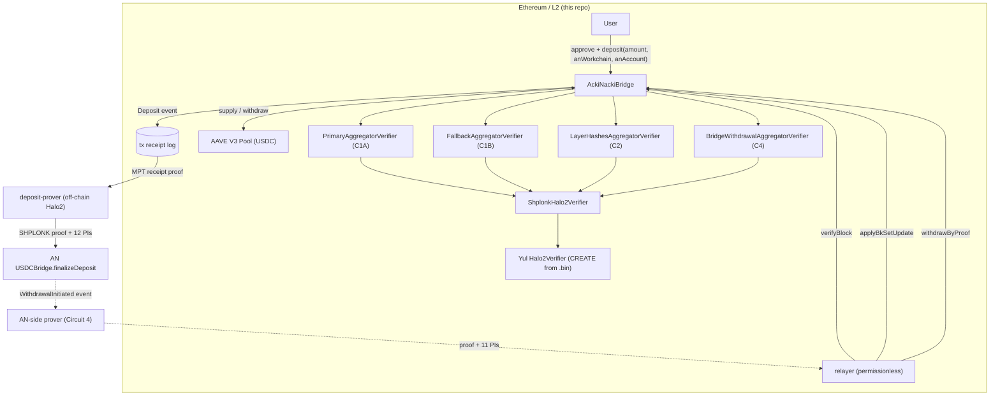

# Ethereum Contracts — Implementation Specification

**Status:** as-implemented (descriptive, not aspirational).
**Derived from:** the Solidity sources under `contracts/ethereum/` at commit `a69ba36`
(`Withdraw e2e refactor + final fixes`), `2026-08-18`.
Last functional change to `src/AckiNackiBridge.sol`: `2026-08-06`.
**Re-anchoring note:** §1–§13 and §15–§16 were originally derived at commit `a7a1130` (`2026-08-13`).
`a69ba36` touched **no file under `contracts/ethereum/`** — `git diff --stat a7a1130 a69ba36 -- contracts/ethereum`
is empty — so every `file:line` citation below still resolves unchanged. Only §12.2/§12.3
(deploy-time genesis alignment) and §14 (off-chain surface) were updated for it.
**Method:** written by reading the contract sources only. No pre-existing prose was used as input;
where the older documentation and the code disagree, the divergences are itemised in §16.

> **Path convention.** Every behavioural claim below cites `file:line`. Bare paths beginning
> `src/`, `test/`, `script/` or `verifiers/` are relative to **`contracts/ethereum/`** — this
> document was written next to those sources and moved to `docs/` on 2026-08-18 without rewriting
> its ~400 citations. So `:578` and `src/AckiNackiBridge.sol:578` both mean
> `contracts/ethereum/src/AckiNackiBridge.sol:578`. Any other path is relative to the repository
> root.
>
> Where the code and a comment inside the code disagree, the code wins and the divergence is
> called out.

---

## 1. Scope

This document specifies the complete Ethereum-side contract system: the bridge contract, the ZK
verifier stack it calls, the block-header oracle interface, the deploy scripts, and the on-chain
ABI surface that off-chain components depend on.

Out of scope (referenced only where the EVM side binds to them): the Acki Nacki (AN) TVM contracts,
the Halo2 circuits themselves, and the Rust prover/relayer crates.

### 1.1 File inventory

| Path | Lines | Role |
|---|---:|---|
| `src/AckiNackiBridge.sol` | 1403 | **The bridge.** Custody, deposits, AN-state commitment, withdrawal payout, AAVE yield. |
| `src/IPrimaryVerifier.sol` | 36 | Circuit 1A (primary attestation) verifier interface — 4 PIs. |
| `src/IFallbackVerifier.sol` | 33 | Circuit 1B (fallback attestation) verifier interface — 4 PIs. |
| `src/ILayerHashesMovementVerifier.sol` | 45 | Circuit 2 (layer-hash movement) interface — 14 PIs. |
| `src/IBridgeWithdrawalVerifier.sol` | 77 | Circuit 4 (bridge withdrawal event) interface — 11 PIs. |
| `src/ShplonkAggregatorVerifierBase.sol` | 32 | Shared adapter base: instance reader + SHPLONK dispatch. |
| `src/PrimaryAggregatorVerifier.sol` | 30 | 1A adapter (instances[12..15] ↔ args). |
| `src/FallbackAggregatorVerifier.sol` | 30 | 1B adapter (instances[12..15] ↔ args). |
| `src/LayerHashesAggregatorVerifier.sol` | 34 | Circuit-2 adapter (instances[12..25] ↔ args). |
| `src/BridgeWithdrawalAggregatorVerifier.sol` | 44 | Circuit-4 adapter (instances[12..=22] ↔ `pub`, eleven slots). |
| `src/ShplonkHalo2Verifier.sol` | 31 | `staticcall` shim onto CREATE-deployed Yul verifier bytecode. |
| `src/IShplonkHalo2Verifier.sol` | 7 | `verify(bytes) → bool`. |
| `src/IBlockHeaderOracle.sol` | 27 | Block-hash oracle interface. |
| `src/AxiomBlockHeaderOracle.sol` | 186 | Axiom V2 Core–backed oracle implementation. |
| `src/MockBlockHeaderOracle.sol` | 76 | Test/E2E oracle (owner-settable hashes + `blockhash()` fallback). |
| `src/IAavePool.sol`, `src/IERC20.sol` | 47 / 12 | Minimal external interfaces. |
| `verifiers/*.bin` | — | Production SHPLONK Yul **creation** bytecode (4 circuits). |
| `verifiers/*_calldata.bin` | — | Reference `instances ‖ proof` calldata fixtures. |
| `verifiers/{Primary,Fallback,LayerHashes}AggregatorVerifier.sol` | 82–92 KB | Generated `Halo2Verifier` Yul-in-Solidity sources (reference; the `.bin` is what deploys). |
| `script/*.s.sol`, `script/ShplonkDeployLib.sol` | 61–349 | Deployment. See §8. |
| `test/**` | ~3.4 k | Foundry tests + mocks + fixtures. See §9. |

Nothing under `contracts/ethereum/` is upgradeable: there is no proxy, no admin-upgrade path, and
every verifier binding is `immutable`. Changing a verifier or an identity constant means deploying a
new bridge.

---

## 2. System overview



Two independent directions:

* **ETH → AN (deposit).** Purely an event emission on this side (`AckiNackiBridge.deposit`,
  `src/AckiNackiBridge.sol:578`). No Ethereum-side proof verification is involved; the event's log
  is proven off-chain and consumed natively by the AN `USDCBridge`. The bridge keeps custody of the
  USDC.
* **AN → ETH (state attestation + payout).** `verifyBlock` (`:650`) advances a rolling commitment to
  AN state from two cross-bound ZK proofs; `withdrawByProof` (`:1130`) pays out USDC against a
  Circuit-4 proof anchored into state that `verifyBlock` already recorded. `applyBkSetUpdate`
  (`:799`) rotates the AN validator-set (BK-set) commitment.

There is **no** `withdraw(depositId, …)` refund path; it was retired (contract header comment,
`:19-25`).

---

## 3. `AckiNackiBridge` — constants

| Constant | Value | Line | Meaning |
|---|---|---:|---|
| `USDC_UNIT` | `10**6` | 56 | USDC has 6 decimals. Declared, not used internally. |
| `MAX_DEPOSIT_AMOUNT` | `type(uint64).max` | 61 | Per-tx deposit cap. Chosen so the amount fits the AN `USDCBridge` mint path (`fr[2]` as `uint64`), **not** as a TVL limit. |
| `BPS_DENOMINATOR` | `10_000` | 64 | Basis-point denominator. |
| `MAX_LIQUID_RESERVE_BPS` | `5_000` | 67 | Liquid reserve is capped at 50 %. |
| `MAX_LAYER_HASHES` | `10` | 71 | Layer slots per AN block (mirrors Circuit 2 `MAX_LAYERS`). |
| `HISTORY_PROOF_WINDOW` | `128` | 74 | Rolling-window depth **per layer**. |
| `BN254_R` | `0x30644e72…f0000001` | 78 | BN254 scalar field order; used only by `applyBkSetUpdate` to reduce a SHA-256 root into `Fr`. |
| `RECIPIENT_HALF_MASK` | `(1 << 80) - 1` | 1088 | 10-byte half of a split-α recipient address. |

`enum FinalizationType { Primary, Fallback }` (`:84`) mirrors the AN attestation circuit's binary
split (≥ 2/3 quorum vs > 1/2 split).

---

## 4. Storage

### 4.1 Mutable state (declaration order)

Slots below are derived from Solidity's packing rules by inspection; re-derive with
`forge inspect AckiNackiBridge storage-layout` before relying on them for a storage-level migration.

| Slot | Offset | Var | Type | Line | Written by |
|---:|---:|---|---|---:|---|
| 0 | 0 | `depositCounter` | `uint256` | 94 | `deposit` |
| 1 | 0 | `treasuryBalance` | `uint256` | 98 | `deposit` (+), `withdrawByProof` (−) |
| 2 | 0 | `blockHeaderOracle` | `IBlockHeaderOracle` | 104 | constructor only |
| 2 | 20 | `aaveEnabled` | `bool` | 120 | constructor, `setAaveEnabled`, `emergencyWithdrawAll` |
| 3 | 0 | `suppliedPrincipal` | `uint256` | 123 | `supplyToAave`, `_pullFromAave`, `emergencyWithdrawAll` |
| 4 | 0 | `liquidReserveBps` | `uint256` | 128 | constructor (`1_000`), `setLiquidReserveBps` |
| 5 | 0 | `owner` | `address` | 131 | constructor, `transferOwnership` |
| 6 | 0 | `yieldRecipient` | `address` | 134 | constructor, `setYieldRecipient` |
| 7 | 0 | `_reentrancyStatus` | `uint256` | 139 | `nonReentrant` |
| 8 | 0 | `storedBkSetCommitment` | `uint256` | 167 | constructor, `applyBkSetUpdate` |
| 9 | 0 | `storedLastBkSetUpdateSeqNo` | `uint64` | 172 | `applyBkSetUpdate` |
| 9 | 8 | `storedLastSeenBlockSeqNo` | `uint64` | 176 | constructor, `verifyBlock` |
| 10 | — | `_nullifiers` | `mapping(bytes32 ⇒ bool)` | 238 | `withdrawByProof` |
| 11 | — | `_layerWindows` | `mapping(uint8 ⇒ HistoryWindow)` | 260 | `_appendLayer` |

`blockHeaderOracle` is **write-only in practice**: it is set in the constructor (`:525`) and never
read anywhere in `src/`. It is retained for a future burn-proof flow (`:100-104`).

### 4.2 Immutables (no storage)

| Var | Type | Line | Notes |
|---|---|---:|---|
| `usdc` | `IERC20` | 111 | Deposit/payout token. Must be non-zero. |
| `aavePool`, `aUSDC` | `IAavePool`, `IERC20` | 114, 117 | Both zero ⇒ AAVE disabled; exactly one zero ⇒ constructor reverts. |
| `primaryVerifier`, `fallbackVerifier`, `layerHashesVerifier` | interfaces | 150, 156, 162 | Any zero ⇒ `verifyBlock` disabled. |
| `storedPrevMaxLevelLayerHash` | `uint256` | 204 | **Genesis seed only** since storage v2.0 (2026-08-04). Read exclusively by `_expectedPrevAnchor` when no layer window is populated (`:1118`). |
| `bridgeWithdrawalVerifier` | `IBridgeWithdrawalVerifier` | 208 | Zero ⇒ `withdrawByProof` disabled. |
| `bridgeWithdrawalDappFr`, `bridgeWithdrawalAccFr` | `uint256` | 216, 219 | AN-side bridge identity the C4 proof must bind to. |
| `bridgeWithdrawalAltDstChainId`, `bridgeWithdrawalAltDstHostChainId`, `bridgeWithdrawalAltTokenId` | `uint256` | 222, 226, 229 | Shellnet/testnet aliases (§7.2). |

### 4.3 `HistoryWindow` (`:252-258`)

```solidity
struct HistoryWindow {
    uint256[128] data;      // layer-hash values, circular
    uint64[128]  heights;   // ABI-stable, always zero; seq_nos are in LayerAnchorAppended
    uint16 dataLen;         // saturating fill level, capped at 128
    uint16 writeCursor;     // next write index
    uint64 lastHeight;      // height of the most recent append
}
```

One window per layer `L ∈ [1, 10]`, in `_layerWindows`. `heights` is ABI-stable but
**not written** on `verifyBlock` — `lastHeight` is the monotonicity guard, and
per-slot seq_nos are in `LayerAnchorAppended`. The relayer paints `heights` from
those logs on resurrect. This is the **authoritative** AN-state store;
the flat `storedNumLayers` / `storedLayerHashes[10]` cache was removed in storage v2.0 along with the
per-block `storedPrevMaxLevelLayerHash` SSTORE (`:629-633`, ≈ 32 k gas/call saved).

---

## 5. Constructor and deployment configuration

```solidity
constructor(
    address _blockHeaderOracle,   // required, non-zero, never read afterwards
    address _usdc,                // required, non-zero
    address _aavePool,            // 0 ⇒ AAVE disabled
    address _aUSDC,               // 0 ⇒ AAVE disabled
    VerifyBlockConfig memory _vb,
    BridgeWithdrawConfig memory _bw
)                                                        // :509-561
```

`VerifyBlockConfig` (`:435-456`): `primaryVerifier`, `fallbackVerifier`, `layerHashesVerifier`,
`genesisBkSetCommitment`, `genesisPrevMaxLevelLayerHash`, `genesisLastSeenBlockSeqNo`.

`BridgeWithdrawConfig` (`:465-487`): `bridgeWithdrawalVerifier`, `dappFr`, `accFr`, `altDstChainId`,
`altDstHostChainId`, `altTokenId`.

Validation performed (and *not* performed):

| Check | Line | Behaviour |
|---|---:|---|
| `_blockHeaderOracle != 0` | 517 | else `InvalidOracle` |
| `_usdc != 0` | 518 | else `InvalidUsdc` |
| AAVE pair is all-or-nothing | 521-523 | else `InvalidAaveAddress` |
| C4 verifier set ⇒ `accFr != 0` | 542-546 | else `InvalidBridgeWithdrawalIdentity`. **`dappFr == 0` is legal** (shellnet zero-`dapp_id` deployments), despite the NatSpec at `:504-506` saying both must be non-zero. Test `test_constructor_withdrawEnabledWithZeroDappFr_succeeds` pins the code behaviour. |
| C4 verifier set ⇒ `dappFr`, `accFr`, `altTokenId` canonical Fr | | else `FieldElementOutOfRange`. Zero remains legal for `dappFr` and `altTokenId`. |
| `genesisBkSetCommitment != 0` when verifiers wired | — | **Not enforced on-chain**; only the deploy script enforces it (`script/DeployRealBridge.s.sol:122`). |
| verifier triple is all-or-nothing | — | **Not enforced at construction**; a partially wired triple simply makes `verifyBlock` revert `VerifyBlockDisabled` at call time (`:662-667`). |

Post-conditions: `owner = yieldRecipient = msg.sender`, `aaveEnabled = (both AAVE addresses set)`,
`liquidReserveBps = 1_000` (10 %), reentrancy guard armed, `OwnershipTransferred(0, msg.sender)`
emitted (`:554-560`).

---

## 6. ETH → AN: deposits

```solidity
function deposit(uint256 amount, int8 anWorkchain, bytes32 anAccount) external nonReentrant  // :578
```

Sequence (`:582-592`):

1. `amount != 0` else `InvalidAmount`.
2. `amount <= MAX_DEPOSIT_AMOUNT` else `DepositTooLarge`.
3. `anAccount != 0` else `InvalidAnAccount` — an EVM address is not a valid AN recipient, so the
   256-bit TVM destination is supplied explicitly.
4. `usdc.transferFrom(msg.sender, address(this), amount)`; a `false` return ⇒ `TransferFromFailed`.
5. `depositId = depositCounter++`, `treasuryBalance += amount`.
6. `emit Deposit(depositId, msg.sender, amount, anWorkchain, anAccount, block.timestamp)`.

Notes that matter downstream:

* Funds stay as plain USDC in the contract; batching into AAVE is a separate owner action (§10).
* `amount` is credited as requested, not as the observed balance delta — a fee-on-transfer token
  would over-credit `treasuryBalance`. USDC is not fee-on-transfer.
* The `Deposit` **event layout is a hard cross-repo ABI**: the off-chain prover parses
  `topics[1] = depositId`, `topics[2] = sender`, and reads `data` word-wise, including
  `anWorkchain` at `data[63]` (`deposit-prover/src/ethereum_fetcher.rs:128`). Reordering or
  retyping event fields breaks proof generation, not just indexing.
* The proof's 12 public inputs are `deposit_id, sender, amount, contract_address, chain_id,
  dapp_id_{high,low}, an_account_{high,low}, block_hash_{high,low}, promise_commit`
  (`crates/deposit-relayer-daemon/src/types.rs:101-115`). `anWorkchain` is emitted by the contract
  but is **not** one of them — `dappId` (a config-supplied tag) replaced it.
* Deposits are provable from an allowlisted set of chains: OP Mainnet (10), World Chain (480),
  Mantle (5000), Base (8453), Arbitrum One (42161), Blast (81457), Sepolia (11155111)
  (`crates/deposit-chain-ids/src/lib.rs:30-38`). Ethereum mainnet (1) is **not** in that list. The
  contract itself is chain-agnostic; the constraint lives in the prover/relayer allowlist and the
  AN-side `(chainId → bridge Fr)` allowlist.

---

## 7. AN → ETH

### 7.1 `verifyBlock` — advance the AN state commitment

```solidity
function verifyBlock(
    FinalizationType finType,
    bytes calldata attestationProof,
    bytes calldata layerHashesProof,
    uint256 blockId,
    uint256 bkSetCommitment,
    uint64  blockSeqNo,
    uint8   numLayers,
    uint256[10] calldata layerHashes,
    uint256 prevMaxLevelLayerHash
) external nonReentrant                                   // :650-758
```

Permissionless. Order of operations is deliberately cheap-checks-first, then crypto, then effects:

| # | Check | Line | Revert |
|---:|---|---:|---|
| 1 | all three verifier slots non-zero | 662 | `VerifyBlockDisabled` |
| 2 | `1 ≤ numLayers ≤ 10` | 670 | `InvalidNumLayers` |
| 3 | `layerHashes[i] == 0` for `i ≥ numLayers` | 673 | `LayerHashTailNonZero(i)` |
| 4 | `layerHashes[i] != 0` for `i < numLayers` | 678 | `LayerHashActiveZero(i)` (QC-A2-3: a zero active slot would let `_appendLayerHashes` skip a layer and desync the windows) |
| 5 | `bkSetCommitment == storedBkSetCommitment` | 683 | `BkSetCommitmentMismatch` |
| 6 | `blockSeqNo > storedLastSeenBlockSeqNo` | 686 | `BlockSeqNoNotMonotonic` |
| 7 | `prevMaxLevelLayerHash == _expectedPrevAnchor(numLayers)` | 698-703 | `PrevAnchorMismatch` |
| 8 | attestation proof accepted (1A or 1B per `finType`) | 713-733 | `AttestationProofRejected` |
| 9 | layer-hash proof accepted | 735-745 | `LayerHashesProofRejected` |

The attestation call passes the **pre-update** `storedLastSeenBlockSeqNo` as the circuit's
`lastSeenBlockSeqNo` public input (`:721`, `:729`) — that is what binds the submitted block to the
contract's current cursor inside the proof, in addition to check 6.

Cross-circuit binding: the same `blockId` and `bkSetCommitment` values are forwarded to both
verifiers, and each adapter compares them byte-for-byte against instances read out of its own proof
(§8.1). Two proofs about different AN blocks therefore cannot both pass with one argument set.

Effects, in CEI order (`:754-757`):

* `storedLastSeenBlockSeqNo = blockSeqNo`;
* `_appendLayerHashes(numLayers, layerHashes, blockSeqNo)` — for `L = 1..numLayers`, append
  `layerHashes[L-1]` into window `L` (`:902-913`);
* `emit BlockVerified(blockId, blockSeqNo, finType, numLayers)` plus one
  `LayerAnchorAppended(L, hash, height)` per appended layer (`:933`).

`_appendLayer` (`:916-934`) additionally enforces `1 ≤ layer ≤ 10` (`LayerOutOfRange`) and
`blockHeight >= w.lastHeight` (`NonMonotonicLayerHeight`, non-strict), then writes at `writeCursor`,
advances the cursor mod 128, saturates `dataLen` at 128, and records `lastHeight`.

The contract does **not** require `blockSeqNo == storedLastSeenBlockSeqNo + 1`; gaps are permitted
(covered by `test_relayerLoop_seqNoFastForward_isPermittedByContract`). Continuity is the prover's
and relayer's responsibility.

#### Chain anchor: `_expectedPrevAnchor` (`:990-997`)

```
t = _highestActiveLayer()                  // highest L with dataLen > 0, else 0
if t == 0: return storedPrevMaxLevelLayerHash    // immutable genesis seed
pick = min(numLayers, t)
return _layerLatest(pick)                  // head of window `pick`
```

This mirrors the prover's `BridgeState::prev_max_level_layer_hash_for`
(`crates/bridge-prover-libraries/bridge-prover-lib/src/bridge_state.rs`). A flat
`layerHashes[numLayers - 1]` anchor diverges whenever `numLayers` *decreases* between consecutive
key blocks, which would halt `verifyBlock` permanently (AB-Q4). Relayers must read
`expectedPrevAnchor(numLayers)` (`:1004`) rather than reconstructing the anchor themselves.

### 7.2 `withdrawByProof` — pay out a proven AN withdrawal

```solidity
function withdrawByProof(
    bytes calldata proof,
    IBridgeWithdrawalVerifier.WithdrawalPublicInputs calldata pub
) external nonReentrant returns (bool success)            // :1130-1215
```

Permissionless; gas is paid by the caller (typically a relayer) while funds go to `recipient`.

Public inputs (`src/IBridgeWithdrawalVerifier.sol:30-56`), slots `[0..9]` in circuit order:
`tokenId, amount, recipientHi, recipientLo, dstChainId, senderAccFr, dappFr, accFr, nullifier,
finalRoot`.

| # | Check | Line | Revert |
|---:|---|---:|---|
| 1 | C4 verifier wired | 1134 | `WithdrawByProofDisabled` |
| 2 | `pub.dappFr == bridgeWithdrawalDappFr && pub.accFr == bridgeWithdrawalAccFr` | 1139 | `WithdrawIdentityMismatch` |
| 3 | `pub.dstChainId == block.chainid`, **or** the scoped alias: `altDstChainId != 0 && altDstHostChainId != 0 && block.chainid == altDstHostChainId && pub.dstChainId == altDstChainId` | 1142-1149 | `DstChainIdMismatch` |
| 4 | `pub.tokenId == 0`, **or** `altTokenId != 0 && pub.tokenId == altTokenId` | 1150-1154 | `UnsupportedTokenId` |
| 5 | `recipientHi ≤ 2^80-1`, `recipientLo ≤ 2^80-1` | 1155-1160 | `RecipientHalfOutOfRange` |
| 6 | reconstructed recipient `!= address(0)` (WD-Q2: checked *before* the expensive verify) | 1163 | `InvalidRecipient` |
| 7 | `!_nullifiers[bytes32(pub.nullifier)]` | 1167 | `NullifierAlreadyUsed` |
| 8 | `_isKnownAnchor(pub.finalRoot)` | 1176 | `UnknownAnchor` |
| 9 | `bridgeWithdrawalVerifier.verifyWithdrawal(proof, pub)` | 1184 | `WithdrawalProofRejected` |
| 10 | `pub.amount ≤ treasuryBalance` | 1188 | `WithdrawTreasuryShortfall` |

Effects then interactions (`:1192-1213`): mark the nullifier used, `treasuryBalance -= amount`;
then, if liquid USDC < `amount` and `suppliedPrincipal > 0`, pull `min(shortfall, suppliedPrincipal)`
back from AAVE; then `usdc.transfer(recipient, amount)` (`false` ⇒ `WithdrawTransferFailed`); then
`emit WithdrawalByProofExecuted(nullifier, recipient, amount, tokenId, msg.sender)`. Returns `true`.

Recipient reconstruction is split-α: `address(uint160((hi << 80) | lo))` (`:1227-1231`).

**Anchor semantics.** `_isKnownLayerAnchor` (`src/AckiNackiBridge.sol`) scans
only the window named by Circuit 4's 1-indexed `anchorLayer` public input
(`1..=MAX_LAYER_HASHES`, also range-checked in-circuit). A proof whose
`finalRoot` sits in a different layer's window is rejected (`UnknownAnchor`),
even if that root is a genuine `verifyBlock` anchor. A miss costs at most
128 cold SLOADs, paid by the caller whose call then reverts.

**Replay scope.** The nullifier map is per-contract, and `dstChainId` must match the executing chain
(or its scoped alias), so the same proof cannot be replayed on a second deployment. The
`altDstHostChainId` field exists precisely so a shellnet proof for logical chain `1` cannot execute
on a deployment whose host chain is not the configured one. The Circuit 4 preimage does not bind
`msg_id`, so two identical burns in one AN block share a nullifier (trade-off 12).

### 7.3 `applyBkSetUpdate` — rotate the BK-set commitment

```solidity
function applyBkSetUpdate(
    FinalizationType finType,
    bytes calldata attestationProof,
    uint256 blockId,
    uint64  blockSeqNo,
    uint256 oldCommitmentL2,
    uint256 newCommitmentL3,
    bytes32 siblingH01,
    bytes32 siblingH4_7,
    bytes32 siblingH8_15
) external nonReentrant                                   // :799-878
```

Permissionless. Gate: `primaryVerifier` and `fallbackVerifier` both non-zero (`:810`, note
`layerHashesVerifier` is **not** required) else `BkUpdateDisabled`.

1. `oldCommitmentL2 == storedBkSetCommitment` else `StaleBkSetCommitment` (`:814`).
2. `blockSeqNo > storedLastBkSetUpdateSeqNo` else `BkUpdateSeqNoNotMonotonic` (`:817`) — an
   **independent** cursor from `storedLastSeenBlockSeqNo`.
3. Attestation proof verified with `(blockId, oldCommitmentL2, blockSeqNo, storedLastSeenBlockSeqNo)`
   (`:821-839`).
4. Open the depth-4 / 16-leaf block-id tree at leaves 2 and 3 (`:854-859`):

   ```
   h23   = SHA256( LE32(oldCommitmentL2) ‖ LE32(newCommitmentL3) )
   h0_3  = SHA256( siblingH01 ‖ h23 )
   h0_7  = SHA256( h0_3       ‖ siblingH4_7 )
   root  = SHA256( h0_7       ‖ siblingH8_15 )
   require( root mod BN254_R == blockId )      // else BkUpdateMerkleMismatch
   ```

   The two commitments are byte-reversed to little-endian first (`_frToLeBytes`, `:891-898`) because
   the AN side hashes canonical `Fr::to_repr()`; the siblings are opaque SHA-256 outputs and are not
   reversed. The `% BN254_R` reduction (`:869`) reconciles the raw SHA-256 root with the canonical
   `Fr` image that the attestation adapter compares against — without it roughly four rotations in
   five would be unsatisfiable by any argument.

5. Effects: `storedBkSetCommitment = newCommitmentL3`, `storedLastBkSetUpdateSeqNo = blockSeqNo`,
   `emit BkSetUpdated(old, new, blockSeqNo)` (`:874-877`).

`storedLastSeenBlockSeqNo` is **not** advanced by a rotation.

**Operator rule.** Attestation `lastSeen` is the live layer cursor
`storedLastSeenBlockSeqNo`. `storedLastBkSetUpdateSeqNo` is monotonicity
only — a rotation proof baked against that cursor fails after the first
`verifyBlock`. If `verifyBlock` advances between prove and submit, re-prove;
do not treat `AttestationProofRejected` as a consensus bug.

### 7.4 Read surface for AN state

| View | Line | Returns |
|---|---:|---|
| `expectedPrevAnchor(uint8 numLayers)` | 1004 | The anchor the next `verifyBlock` will require. |
| `getLatestPerLayer()` | 1054 | `uint256[10]`, entry `[L-1]` = head of window `L` (0 if empty). Replaces the removed `getStoredLayerHashes()`. |
| `isKnownAnchor(uint256)` | 1069 | Flat membership across all 10 windows (same predicate `withdrawByProof` uses). |
| `isKnownLayerAnchor(uint8, uint256)` | 1074 | Membership in one window. |
| `isNullifierUsed(uint256)` | 1220 | Replay pre-check for relayers. |

---

## 8. Verifier stack

```
AckiNackiBridge
  └─ I{Primary,Fallback,LayerHashesMovement,BridgeWithdrawal}Verifier
       └─ *AggregatorVerifier          (typed adapter: instance ↔ argument equality)
            └─ ShplonkHalo2Verifier    (staticcall shim, code-size checked)
                 └─ Halo2Verifier      (snark-verifier-sdk Yul, CREATE-deployed from .bin)
```

### 8.1 Adapters

`ShplonkAggregatorVerifierBase` (`src/ShplonkAggregatorVerifierBase.sol`) defines
`NUM_ACCUMULATOR_INSTANCES = 12` (the KZG pairing accumulator limbs of the snark-verifier-sdk
layout), `_readInstance(data, i)` = `uint256(bytes32(data[i*32 : i*32+32]))` with a
`"short instances"` require, and `_verifyShplonk`.

Proof calldata is `instances (12 accumulator + N inner + 1 inner-VK digest) ‖ snark_proof`. Each
adapter:

1. returns `false` if `proof.length < (12 + N + 1) * 32`;
2. compares every re-exposed inner instance at index `12 + k` against the corresponding argument,
   returning `false` on the first mismatch;
3. returns `false` if the instance at index `12 + N` does not equal the adapter's immutable
   `vkDigest` (Poseidon digest of the inner-circuit VK witnesses; base contract's constructor
   rejects `bytes32(0)`);
4. delegates to the Yul verifier.

| Adapter | N | Instance index ↔ argument |
|---|---:|---|
| `PrimaryAggregatorVerifier` / `FallbackAggregatorVerifier` | 4 | 12 `blockId`, 13 `bkSetCommitment`, 14 `blockSeqNo`, 15 `lastSeenBlockSeqNo` |
| `LayerHashesAggregatorVerifier` | 14 | 12 `blockId`, 13 `bkSetCommitment`, 14 `numLayers`, 15–24 `layerHashes[0..9]`, 25 `prevMaxLevelLayerHash` |
| `BridgeWithdrawalAggregatorVerifier` | 11 | 12 `tokenId`, 13 `amount`, 14 `recipientHi`, 15 `recipientLo`, 16 `dstChainId`, 17 `senderAccFr`, 18 `dappFr`, 19 `accFr`, 20 `nullifier`, 21 `finalRoot`, 22 `anchorLayer` |

All four are `view` and return `bool` — reverts inside the Yul verifier surface as `false`
because `ShplonkHalo2Verifier.verify` captures only the `staticcall` success flag (`:29`).

### 8.2 `ShplonkHalo2Verifier`

Constructor rejects `address(0)` (`InvalidYulVerifierAddress`) and `extcodesize == 0`
(`EmptyYulVerifierCode`, QC-A4-1) — so a CREATE failure cannot silently produce a shim that
"verifies" everything by calling an empty account. `verify` forwards raw calldata to the Yul
contract's fallback entrypoint via `staticcall`.

### 8.3 Deployed artefacts

| `.bin` (creation bytecode) | Circuit | Inner PIs | Size (B) | Reference calldata (B) |
|---|---|---:|---:|---:|
| `PrimaryAggregatorVerifier.bin` | 1A | 4 | 21 655 | 3 872 |
| `FallbackAggregatorVerifier.bin` | 1B (inner K=21) | 4 | 21 655 | 3 872 |
| `LayerHashesAggregatorVerifier.bin` | 2 (k_outer=22) | 14 | 19 263 | 3 104 |
| `BridgeWithdrawalAggregatorVerifier.bin` | 4 | 11 | 21 314 | 3 680 |

Sizes measured on disk at this commit; all are under the EIP-170 24 576-byte limit, which
`scripts/check_eip170_verifier_bins.sh` enforces in CI. Circuit 1B is keygen'd at inner `K=21`
specifically so its aggregated Yul fits: at `K=20` it auto-configures 44 advice columns and the
output exceeds ~28 KB (`verifiers/README.md`: Circuit 1B inner `K=21`). 

`verifiers/*.sol` are the generated `Halo2Verifier` sources (a single `fallback(bytes) → bytes` with
inline assembly) kept for reference; deployment always goes through `create` on the `.bin`
(`script/ShplonkDeployLib.sol:56-63`) because Foundry's optimizer settings can otherwise perturb the
generated assembly.

---

## 9. Block-header oracle

`IBlockHeaderOracle` (`getBlockHash`, `isBlockHashAvailable`, `getLatestVerifiedBlock`) has two
implementations:

* **`AxiomBlockHeaderOracle`** — wraps `IAxiomV2Core`. `getBlockHash` serves blocks within
  `MAX_BLOCKHASH_AGE = 256` from the `blockhash()` opcode and *reverts* for older blocks, directing
  callers to `verifyBlockHash(blockNumber, claimedHash, witness)`, which forwards to
  `axiomV2Core.isBlockHashValid` (`src/AxiomBlockHeaderOracle.sol:64-155`). `verifyRecentBlockHash`
  uses `isRecentBlockHashValid`. Axiom V2 Core address is `0x6996…C98B` on both mainnet and Sepolia
  (`axiom-config.json`); the Sepolia deployment is Axiom's **mock** core, which skips ZK verification
  while implementing the same interface.
* **`MockBlockHeaderOracle`** — owner-settable hash map plus a `blockhash()` fallback, for tests and
  E2E on post-merge chains.

Note that `isBlockHashAvailable` returns `true` for any past block beyond 256 on the Axiom oracle
(`:106-109`) on the assumption that Axiom caches back to genesis, even though `getBlockHash` will
revert for those.

**Neither oracle is on any live path today**: the bridge stores the address and never calls it (§4.1).
All deploy scripts except `DeployRealBridge` with `USE_AXIOM_ORACLE=true` wire the mock.

---

## 10. AAVE yield module (owner-only)

Idle USDC can be routed into the AAVE V3 USDC market; user principal accounting (`treasuryBalance`)
is independent of the aToken balance. For the operator's view of this module — which collector
applies to which pocket, the ordering rule, and the `owner` / `yieldRecipient` divergence — see
[`aave-yield.md`](aave-yield.md).

| Function | Line | Behaviour |
|---|---:|---|
| `supplyToAave(amount)` | 1240 | Requires `aaveEnabled`. `available = _amountSupplyable()`; `amount == type(uint256).max` supplies all of it. `approve` + `supply`, `suppliedPrincipal += toSupply`. |
| `withdrawFromAave(amount)` | 1258 | Pull back up to `suppliedPrincipal` preemptively. |
| `emergencyWithdrawAll()` | 1477 | Disables AAVE and `withdraw(max)`. Reverts `EmergencyLeftoverAToken` if aUSDC remains. If `received < principal`, keeps the shortfall on `suppliedPrincipal`; otherwise zeroes it. Yield that came back with the drain is liquid — collect with `skimExcessUsdc`, not `harvestYield` (QC-A1-3). Payouts stay available. |
| `harvestYield(amount)` | 1497 | `amount ≤ accruedYield()` — yield still inside AAVE. After a successful emergency this is zero and the call reverts `NoYield`. |
| `skimExcessUsdc(amount)` | 1525 | QC-A1-3: sweeps liquid USDC above `treasuryBalance` (typically post-emergency yield) to `yieldRecipient`. |
| `setAaveEnabled(bool)` | 1328 | Enabling with `aavePool == 0` reverts `InvalidAaveAddress`. |
| `setLiquidReserveBps(bps)` | 1335 | Capped at `MAX_LIQUID_RESERVE_BPS` (50 %). |
| `setYieldRecipient(addr)` | 1341 | Non-zero. |
| `transferOwnership(addr)` | 1347 | Non-zero; single-step. |

Helpers: `_amountSupplyable()` = `balanceOf(this) − treasuryBalance * liquidReserveBps / 10_000`,
floored at 0 (`:1358`). `_pullFromAave(amount)` withdraws `min(amount, suppliedPrincipal)`, requires
the *received* delta to cover both `toPull` and `amount` (`AaveWithdrawFailed`), and decrements
`suppliedPrincipal` (`:1366-1380`).

Views: `aUsdcBalance()`, `accruedYield()` = `aUsdcBalance − suppliedPrincipal` floored at 0,
`totalAssets()` = liquid USDC + aUSDC (`:1387-1402`).

### 10.1 Access-control matrix

| Function | Caller |
|---|---|
| `deposit`, `verifyBlock`, `applyBkSetUpdate`, `withdrawByProof` | anyone |
| `supplyToAave`, `withdrawFromAave`, `emergencyWithdrawAll`, `harvestYield`, `skimExcessUsdc`, `setAaveEnabled`, `setLiquidReserveBps`, `setYieldRecipient`, `transferOwnership` | `owner` |
| everything else | view/pure |

There is **no pause switch** (removed in commit `d6bfed4`, "Remove EVM pause") and **no owner path
that can move user principal** — the owner can only route funds between the contract and AAVE, and
skim `balanceOf(this) − treasuryBalance`. `emergencyWithdrawAll` is the AAVE-failure escape hatch.

---

## 11. ABI reference

### 11.1 Events

| Event | topic0 | Indexed |
|---|---|---|
| `Deposit(uint256,address,uint256,int8,bytes32,uint256)` | `0x8d5d060673b27fac84d56ee262fe8dccad60d198ae11766063f112a9be3d37ee` | `depositId`, `sender` |
| `BlockVerified(uint256,uint64,uint8,uint8)` | `0x4a5fe28cf677e5cbd58dbc0d09f8786dcc5203154f0a44ca08de71802838e301` | `blockId`, `blockSeqNo` |
| `LayerAnchorAppended(uint8,uint256,uint64)` | `0xa107038a79964f3eb528acbade584d60e11790b79033d6ca561747c916e2522d` | `layer` |
| `BkSetUpdated(uint256,uint256,uint64)` | `0x3b61abb5642de7c0408ea1d76cdc9a7f26020b2b511a5a0698fc238172674dd1` | `oldCommitment`, `newCommitment`, `blockSeqNo` |
| `WithdrawalByProofExecuted(uint256,address,uint256,uint256,address)` | `0x88738ab1295650557339cebd9882c9db35ae232be3a8fcb180054213fe0dad92` | `nullifier`, `recipient`, `tokenId` |

Also emitted: `SuppliedToAave`, `WithdrawnFromAave`, `YieldHarvested`, `AaveEnabledSet`,
`LiquidReserveBpsSet`, `OwnershipTransferred`, `YieldRecipientSet`, `EmergencyWithdrawAll`,
`ExcessUsdcSkimmed` (`:280-290`).

### 11.2 Selectors

| Selector | Signature |
|---|---|
| `0xa41d0229` | `deposit(uint256,int8,bytes32)` |
| `0x0b932e1b` | `verifyBlock(uint8,bytes,bytes,uint256,uint256,uint64,uint8,uint256[10],uint256)` |
| `0x2a2c14a0` | `applyBkSetUpdate(uint8,bytes,uint256,uint64,uint256,uint256,bytes32,bytes32,bytes32)` |
| `0xa9753d18` | `withdrawByProof(bytes,(uint256,uint256,uint256,uint256,uint256,uint256,uint256,uint256,uint256,uint256,uint256))` |
| `0x6e55e4eb` | `expectedPrevAnchor(uint8)` |
| `0x22c341e9` | `getLatestPerLayer()` |
| `0xe57869a8` | `isKnownAnchor(uint256)` |
| `0xa7744702` | `isKnownLayerAnchor(uint8,uint256)` |
| `0xc6c0572d` | `isNullifierUsed(uint256)` |
| `0xecb3dc88` | `depositCounter()` |
| `0x313dab20` | `treasuryBalance()` |

(Computed from the signatures above; `0xa41d0229` and `0xecb3dc88` cross-check against
`frontend/src/web3.rs:294,390`.)

### 11.3 Custom errors

Deposit/custody: `InvalidAmount`, `InvalidUsdc`, `TransferFromFailed`, `DepositTooLarge`,
`InvalidAnAccount`, `InsufficientTreasury`, `InvalidRecipient`, `InvalidOracle`,
`InvalidAaveAddress`, `NotOwner`, `Reentrancy`, `AaveDisabled`, `ReserveBpsTooHigh`,
`NothingToSupply`, `AaveWithdrawFailed`, `NoYield`, `NoExcessUsdc`.

`verifyBlock`: `VerifyBlockDisabled`, `AttestationProofRejected`, `LayerHashesProofRejected`,
`BkSetCommitmentMismatch`, `BlockSeqNoNotMonotonic`, `PrevAnchorMismatch`, `InvalidNumLayers`,
`LayerHashTailNonZero`, `LayerHashActiveZero`, `LayerOutOfRange`, `NonMonotonicLayerHeight`.

`applyBkSetUpdate`: `BkUpdateDisabled`, `StaleBkSetCommitment`, `BkUpdateSeqNoNotMonotonic`,
`BkUpdateMerkleMismatch`.

`withdrawByProof`: `WithdrawByProofDisabled`, `WithdrawalProofRejected`, `NullifierAlreadyUsed`,
`DstChainIdMismatch`, `RecipientHalfOutOfRange`, `WithdrawIdentityMismatch`, `UnknownAnchor`,
`InvalidBridgeWithdrawalIdentity`, `UnsupportedTokenId`, `WithdrawTransferFailed`,
`WithdrawTreasuryShortfall`.

---

## 12. Deployment

### 12.1 Scripts

| Script | Purpose |
|---|---|
| `DeployRealBridge.s.sol` | Production. Oracle (Axiom or mock), optional AAVE, optional `verifyBlock` triple, **mandatory** C4 withdrawal wiring (NB-Q8 — `WITHDRAW_ACC_FR` is required, `:127-128`, because shipping `address(0)` bricks user withdrawals). Writes `deployment_real.json`. Reverts on chains other than 1 / 11155111 (`:234`). |
| `DeployShellnetE2EBridge.s.sol` | Sepolia shellnet E2E. Mock oracle, no AAVE, SHPLONK triple + C4. `WIRE_WITHDRAW_BY_PROOF=false` is only tolerated on anvil (`:56-59`). Alias defaults: `altDstChainId=1`, `altDstHostChainId=11155111`, `altTokenId=3`. |
| `DeployReuseVerifiersBridge.s.sol` | Fresh bridge reusing already-deployed verifier addresses (verifiers are VK-bound and segment-agnostic); gives an empty nullifier map for a new E2E run. |
| `DeployGenesisCursorBridge.s.sol` | Defines `GenesisCursorBridge`, a subclass that sets `storedLastSeenBlockSeqNo` to a non-zero value post-construction for mid-chain replay E2E. **Not for production.** |
| `DeployTestBridge.s.sol` | Local/testnet smoke: oracle + bridge with everything disabled. |
| `GenDepositSetup.s.sol` | Local only: mock USDC + oracle + bare bridge, mints and pre-approves so a `cast` loop can emit real `Deposit` events for proof generation. |
| `ShplonkDeployLib.sol` | `create`-deploys Yul `.bin` → `ShplonkHalo2Verifier` → typed adapter, for each of the four circuits. |

### 12.2 Environment variables

| Var | Consumed by | Meaning |
|---|---|---|
| `PRIVATE_KEY` | all | Broadcaster. |
| `USE_AXIOM_ORACLE` | RealBridge | `true` ⇒ `AxiomBlockHeaderOracle`, else mock. |
| `USE_AAVE` | RealBridge | Wire AAVE pool + aUSDC for the current chain. |
| `WIRE_VERIFY_BLOCK` | RealBridge | **Required `true` on every chain** (`DeployRealBridge.s.sol:132`, unconditional). On mainnet the value is `envBool` with no default (`:129`); on other nets it used to default false and no longer may. |
| `GENESIS_BK_SET_COMMITMENT` | RealBridge, Shellnet, Reuse, GenesisCursor | Initial BK-set Poseidon commitment (numeric `Fr`; the runbook byte-reverses the prover's LE hex). |
| `GENESIS_PREV_MAX_LEVEL_LAYER_HASH` | same | Immutable genesis anchor seed. |
| `GENESIS_LAST_SEEN_BLOCK_SEQNO` | same | Must equal the `last_seen` baked into the first proof, else the first `verifyBlock` reverts `AttestationProofRejected`. Off-chain it must sit on a key-block boundary: `W·P` with `W = 128` (`bridge-prover-lib/src/poseidon_dense.rs:15`) and `P = 8` (`bridge-prover-lib/src/lib.rs:46`, bumped 4 → 8 in `a69ba36`) ⇒ **1024-aligned**. Deploys made against the old `P = 4` (512-aligned) stride need a fresh genesis seed. |
| `GENESIS_LAST_SEEN_BLOCK_SEQ_NO` | GenesisCursor only | Post-construction cursor override (note the different spelling). |
| `WITHDRAW_ACC_FR` / `WITHDRAW_DAPP_FR` | RealBridge, Shellnet, Reuse | AN-side C4 identity. `ACC_FR` required, `DAPP_FR` may be 0. |
| `WITHDRAW_ALT_DST_CHAIN_ID`, `WITHDRAW_ALT_DST_HOST_CHAIN_ID`, `WITHDRAW_ALT_TOKEN_ID` | same | Shellnet aliases (§7.2). `DeployRealBridge` on mainnet requires all three 0. |
| `SHPLONK_BIN_{PRIMARY,FALLBACK,LAYER_HASHES,WITHDRAWAL}` | ShplonkDeployLib | Override `.bin` paths. |
| `PRIMARY_VERIFIER`, `FALLBACK_VERIFIER`, `LAYER_HASHES_VERIFIER`, `WITHDRAWAL_VERIFIER` | Reuse, GenesisCursor | Existing verifier addresses. |
| `USDC_ADDRESS` | TestBridge | Override token. |

When a verification key rotates, deploy the new Yul verifier (and confirm its
`extcodehash` against `ShplonkDeployLib`) **before** pointing the live bridge at
it. `DeployRealBridge` does this in one broadcast — Yul, then adapter, then the
bridge constructor — so a first-time deploy cannot invert the order. A later
rotation of a live bridge is not scripted: cut the verifier over first, then
the bridge's immutable verifier address (which means a new bridge, or waiting
for an upgrade path). Pointing the bridge at a key that is not on-chain first
makes every `verifyBlock` revert `YulCodehashMismatch` or call the zero
address.

### 12.3 Hard-coded addresses

| Chain | USDC | AAVE V3 Pool | aUSDC | Axiom V2 Core |
|---|---|---|---|---|
| Mainnet (1) | `0xA0b86991…eB48` | `0x87870Bca…A4E2` | `0x98C23E9d…6F5c` | `0x69963768…C98B` |
| Sepolia (11155111) | `0x94a9D9AC…E4C8` (Aave-faucet test USDC) | `0x6Ae43d32…8951` | `0x16dA4541…EB80` | `0x69963768…C98B` (mock core) |

No deployment-address artefact is committed to this repo (`deployment_real.json` is produced at
deploy time and not tracked; `contracts/ethereum/broadcast/` is gitignored, `.gitignore:26`), so
live addresses must come from the operator's deploy record and the forge broadcast log at
`contracts/ethereum/broadcast/DeployShellnetE2EBridge.s.sol/11155111/run-latest.json`.

The current shellnet deployment at the time of writing is **Deploy #8, Sepolia, 2026-08-17** —
bridge, four SHPLONK verifiers, mock oracle, bootstrap seed `8768512` (`W·P = 1024`-aligned, §12.2).
Its address table belongs in the operations documentation, not here: contract identity is a property
of a deployment, and this document describes the code.

### 12.4 Build settings (`foundry.toml`)

`solc 0.8.19`, `optimizer = true`, `optimizer_runs = 1` (optimising for deployment size),
`via_ir = true` (required — several functions are otherwise stack-too-deep; `verifyBlock` scopes
locals explicitly at `:698` and `:713` to stay under 16 live slots so `forge coverage`, which runs
without the optimizer, can still compile it). `ffi = true`. Profiles: `ci` (5000 fuzz runs),
`fork` (`evm_version = "shanghai"`, needed for live AAVE bytecode with PUSH0).

---

## 13. Tests

`forge test` from `contracts/ethereum/` (Foundry is not installed in the environment this document
was written in, so the suite was read, not executed).

| File | Focus |
|---|---|
| `AckiNackiBridgeAave.t.sol` (21) | Constructor wiring, supply/withdraw/harvest/emergency, reserve cap, ownership, `totalAssets` fuzz. |
| `AckiNackiBridgeAaveFork.t.sol` (4) | Mainnet-fork round-trip against real AAVE (`FOUNDRY_PROFILE=fork`). |
| `AckiNackiBridgeApplyBkSetUpdate.t.sol` (11) | Depth-4 fold, off-chain vector match, rejection of the legacy depth-3 root and of unreduced roots, replay/monotonicity, two chained rotations. |
| `AckiNackiBridgeLayerAnchor.t.sol` (4) | `_expectedPrevAnchor` under grow/shrink walks — the AB-Q4 regression. |
| `AckiNackiBridgeStorageV2.t.sol` (3) | Genesis seed immutability, per-layer heads, shallow-successor does not zero deep layers. |
| `AckiNackiBridgeWithdrawByProof.t.sol` (31) | Full `withdrawByProof` matrix: identity, chain-id + alias scoping, cross-chain replay, token id, recipient split, anchors in L1/L2/L3 windows, nullifier replay, same-block duplicate-burn pin, treasury shortfall, byte-for-byte PI forwarding. |
| `AckiNackiBridgeWithdrawByProofOrder2.t.sol` (1) | L1 anchor accepted when `numLayers == 2`. |
| `AckiNackiBridgeProductionVerifyBlock.t.sol` (4) | Real SHPLONK `.bin` + real calldata + `bound_scenario.json`; skipped when artefacts are absent. |
| `AckiNackiBridgeProductionWithdrawByProof.t.sol` (3) | Real C4 verifier: isolated verify, tampered proof, mismatched `pub`. |
| `AckiNackiBridgeRelayerLoop.t.sol` (6) | 10-block mixed-finType walk, restart, replay, fast-forward, verifier-reject leaves state untouched, anchor mismatch. |
| `EthAuditQcHardening.t.sol` (5) | QC-A2-3 zero active layer, QC-A4-1 empty Yul code, skim paths, harvest-after-emergency pin. |
| `FuzzVerifiers.t.sol` (9) | Random/truncated/mutated calldata, field-overflow instance regression, deposit invariants. |
| `ShplonkAggregatorForgery.t.sol` (3) | Groth16-stub proof rejected by the SHPLONK path. |
| `ShplonkDeployLib.t.sol`, `ShplonkSpikeOnChain.t.sol` (4) | Wrapper accepts/rejects spike calldata (`test/fixtures/r15_spike/`, **not** production verifiers). |
| `AxiomBlockHeaderOracle.t.sol` (16) | Oracle recent/historical/future paths. |
| `Halo2PoseidonVerifier.t.sol` (7) | Standalone DarkDEX Poseidon Halo2 verifier bytecode — unrelated to the bridge's live path. |

Mocks (`test/mocks/`): `MockPrimaryVerifier` / `MockFallbackVerifier` are `shouldAccept` toggles that
*additionally* reject any argument `≥ BN254_R`, so they cannot wave through encodings the real
adapter rejects — that gap is how the raw-vs-`Fr` `blockId` bug in `applyBkSetUpdate` stayed hidden
(`test/mocks/MockPrimaryVerifier.sol:22-30`). `MockLayerHashesMovementVerifier` is a plain toggle
with no range check. `MockBridgeWithdrawalVerifier` has loose and strict-PI modes. Plus `MockERC20`,
`MockAave`.

---

## 14. Off-chain integration surface

| Component | Uses |
|---|---|
| `crates/bridge-relayer-daemon` | `verifyBlock`, `applyBkSetUpdate`, `withdrawByProof`, reads `storedLastSeenBlockSeqNo`, `storedBkSetCommitment`, `expectedPrevAnchor(numLayers)`, `storedPrevMaxLevelLayerHash`. Its `MockBridgeClient` mirrors the contract's cheap pre-flight checks exactly (`src/bridge.rs:15-23`). |
| `crates/bridge-relayer-daemon/src/withdraw_e2e/` | In-process AN→ETH withdrawal driver (`a69ba36`): capture the live `WithdrawalInitiated` ExtOut → export + enrich the witness → Circuit-4 SHPLONK proof → optional `withdrawByProof`. Exposed as `relayer withdraw-e2e` (`src/bin/relayer.rs:442`); the ETH leg is opt-in (`--rpc-url` + `--bridge-address` + `--private-key`, with `--dry-run` doing an `eth_call` only), so `run_once` itself has no EVM dependency. |
| `crates/deposit-relayer-daemon` | Polls the `Deposit` log (`src/source.rs:105-115`), 10-block `eth_getLogs` chunks, drives the deposit prover and the AN-side `finalizeDeposit`. |
| `deposit-prover/` | Parses the `Deposit` log from a receipt + MPT proof (`src/ethereum_fetcher.rs:80-128`), emits the 12-PI SHPLONK proof. |
| `frontend/` (WASM) | Calls `deposit(uint256,int8,bytes32)` = `0xa41d0229` and `depositCounter()` — **current**. |
| `crates/eth-frontend` | ⚠️ **Stale ABI.** Declares `deposit(uint256)` and a 4-field `Deposit` event (`src/contract.rs:42,47`) and calls `.deposit(amount)` at `src/contract.rs:133-137`. No such selector exists on the deployed bridge, so that call path cannot succeed against any current deployment. |

**The contract is the only gate.** Until `a69ba36` the relayer polled a `proof_event_*.result.json`
ACK written by `bridge-verifier-daemon` — a dev scaffold that imitated this contract — before
submitting `verifyBlock` / `withdrawByProof`. That gate (`WithdrawalResultGate`, `result_path_for`,
and the `skip_verified_gate` opt-out on both proof sources) has been deleted; the relayer submits
directly and treats the on-chain verifier's success on the real transaction — or its `eth_call`
dry-run — as the only acceptance signal (`crates/bridge-relayer-daemon/src/withdrawal.rs:20-30`).
Consequence for this document: every rejection reason a relayer can observe is one of the custom
errors in §11.3 — nothing off-chain pre-filters submissions any more.

---

## 15. Security properties and observations

Read off the code, without a formal audit claim.

**Enforced invariants**

1. Reentrancy: every state-mutating external entrypoint is `nonReentrant` (`:419-424`).
2. CEI: `withdrawByProof` marks the nullifier and decrements `treasuryBalance` *before* the AAVE pull
   and the USDC transfer (`:1192-1209`); `verifyBlock` commits state only after both verifiers pass.
3. Monotonicity: `blockSeqNo` strictly increases per `verifyBlock`; the BK-update cursor increases
   strictly and independently; per-layer window heights are non-decreasing.
4. Cross-circuit binding: shared `blockId` / `bkSetCommitment` are compared instance-by-instance
   inside each adapter, so a mismatched proof pair cannot pass.
5. Payout uniqueness: nullifier map + `dstChainId == block.chainid` (or scoped alias) confine a proof
   to one execution on one deployment.
6. User principal is not owner-reachable: owner functions move funds only between the contract and
   AAVE, or skim strictly above `treasuryBalance`.

**Deliberate trade-offs and limitations (all flagged in-code)**

1. *Anchor layer is asserted* (`withdrawByProof`). Circuit 4 exposes
   `anchorLayer` (`1..=10`); the contract scans only that layer's 128-slot
   window. A `finalRoot` that is a known anchor of a *different* layer
   reverts `UnknownAnchor`.
2. *Anchor-miss gas.* At most 128 cold SLOADs on a failing call, paid by
   the caller. An `O(1)` membership map would need eviction handling on window rollover.
3. *Window depth is finite, per layer.* Each layer keeps 128 anchors, so an anchor older than 128
   appends in **its own layer** is evicted and a proof against that anchor reverts. This is a
   deadline, not a loss: the witness builder escalates a layer at a time
   (`--anchor-layer auto`, the relayer default), and because a layer L(n) anchor is appended only
   at its own W^n boundary, the deadline grows with that boundary rather than repeating the
   window below it. L1 window = 128 × W·P = 131 072 seq (**≈ 12 hours** at ~3 seq/s); L2 =
   128 × W² = 2 097 152 seq (**≈ 8 days**). The L1→L2 step is ×(W/P) = **16**, not ×128; only
   L2→L3 and above are ×W. L3 ≈ 2.8 years. Escalation cannot double-pay, because the nullifier
   is `Poseidon(block_id, tokenId, amount, hi, lo, sender, events_pos)` and takes no root as input.

   So the operational boundary on the pinned shellnet deploy (L1+L2 active) is **≈ 8 days
   unwithdrawn**. Past L(max) a payout is stranded in `treasuryBalance`. Adding a layer
   rescues only an event whose T_n the chain has not yet passed; a T_n that went by before
   that layer was relayed is never appended. Tests: `test/WithdrawAnchorEviction.t.sol` (eviction at 128,
   a seq_no jump not mass-evicting, re-proving against a still-in-window anchor) and
   `AckiNackiBridgeWithdrawByProof.t.sol:593-659` (L2 and L3 anchors accepted, no-window
   rejected).

   The 8-day L2 figure assumes AN reports `numLayers = 1` on non-boundary
   bundles. The contract appends one slot per reported layer on every
   successful `verifyBlock`, with no dedup. If AN started reporting
   `numLayers = 2` on every bundle, the L2 window would fill at the L1
   cadence and the horizon would collapse from days to hours.
4. *No pause, no upgrade.* Response to a discovered verifier bug is redeployment plus migration; only
   the AAVE side has an emergency lever.
5. ~~*Single-step ownership transfer* — a mistyped owner is unrecoverable.~~ **Closed.**
   Transfer is two-step: `transferOwnership` records `pendingOwner` (`:143`) and only
   `acceptOwnership` (`:1551`), called by that address, moves `owner`. A mistyped address can never
   accept, so the mistake is recoverable by overwriting `pendingOwner`.
6. ~~*`approve` return value ignored* in `supplyToAave`; `deposit` books the requested amount, not
   the observed delta.~~ **Closed.** `supplyToAave` reverts `ApproveFailed` on a falsy return
   (`:1436`, error at `:387`), and the transfer paths measure `balanceOf` before and after and
   revert `TransferAmountMismatch` when the delta differs from the amount booked (`:1387-1393`,
   error at `:364`). A fee-on-transfer or rebasing token now fails closed instead of crediting
   book value it never received.
7. *Solvency is not re-checked against real assets.* `treasuryBalance` is book value; if AAVE were to
   lose value, `withdrawByProof` fails late (`WithdrawTreasuryShortfall` or the raw transfer),
   first-come-first-served.
8. *Zero `dappFr` is accepted* at construction, so on a shellnet-style deployment the AN-side identity
   is pinned by `accFr` alone.
9. *`blockHeaderOracle` is dead weight* — a required, non-zero constructor argument that no code path
   reads.
10. ~~*Genesis parameters are unvalidated on-chain.*~~ **Partly closed.** With the
    verifiers wired the constructor now rejects a zero `genesisBkSetCommitment`
    (`ZeroBkSetCommitment`, `:603`) and a non-canonical `genesisBkSetCommitment` or
    `genesisPrevMaxLevelLayerHash` (`FieldElementOutOfRange`) — the same invariant
    `applyBkSetUpdate` enforces, so a value that could never match `_expectedPrevAnchor` can no
    longer be deployed. Zero stays legal for the prev anchor, since a first block may genuinely
    carry it. `genesisLastSeenBlockSeqNo` remains unvalidated: any value is self-consistent, so
    only the deploy script can catch a wrong one.
11. *`GenesisCursorBridge`* (in `script/DeployGenesisCursorBridge.s.sol`) can seed the cursor
    arbitrarily. It is explicitly test-only, but it lives in the same tree as production scripts.
12. ~~*Duplicate burns in one AN block share a Circuit 4 nullifier.*~~ **Closed.**
    The preimage is now `Poseidon(block_id_fr, tokenId, amount, recipientHi,
    recipientLo, senderAccFr, events_pos)`. Two identical `initiateWithdrawal`
    calls in the same block occupy different events-tree leaves, so they
    mint distinct nullifiers. The circuit binds `events_pos` to the Merkle
    direction bits (heap-index reconstruction), so a custom prover cannot
    vary a fake position to double-spend one event.

---

## 16. Divergences from older prose docs

The root `README.md` and much of `docs/` predate the current code. Concretely, as of this commit the
code contradicts them on:

* `deposit()` takes **USDC via `transferFrom`**, not ETH; the signature is
  `deposit(uint256, int8, bytes32)`; `MAX_DEPOSIT_AMOUNT` is `type(uint64).max`, not `100 ether`.
* The `Deposit` event carries six fields including the AN destination, not four.
* Verification is **SHPLONK aggregator Yul** for all four circuits; the gnark Groth16 wrappers and
  the `*Groth16VerifierGenerated.sol` files described in the README no longer exist in `src/`.
* `verifyBlock`'s anchor check is the per-layer `expectedPrevAnchor(numLayers)` pick, not a flat
  `storedPrevMaxLevelLayerHash` comparison; `storedPrevMaxLevelLayerHash` is now an immutable
  genesis seed.
* The AN→ETH payout path (`withdrawByProof`, Circuit 4) exists and is mandatory in the production
  deploy script; the README still describes withdrawals as a future milestone.
* `applyBkSetUpdate` opens a **16-leaf, depth-4** block-id tree (three siblings), not an 8-leaf tree.

Treat this file as the current description of the Ethereum contracts, and `contracts/ethereum/src/`
as the ground truth behind it.
