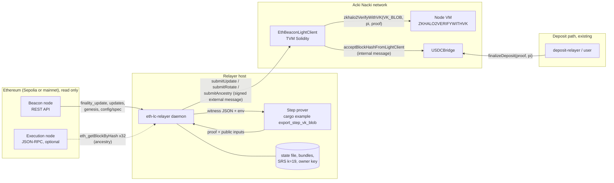
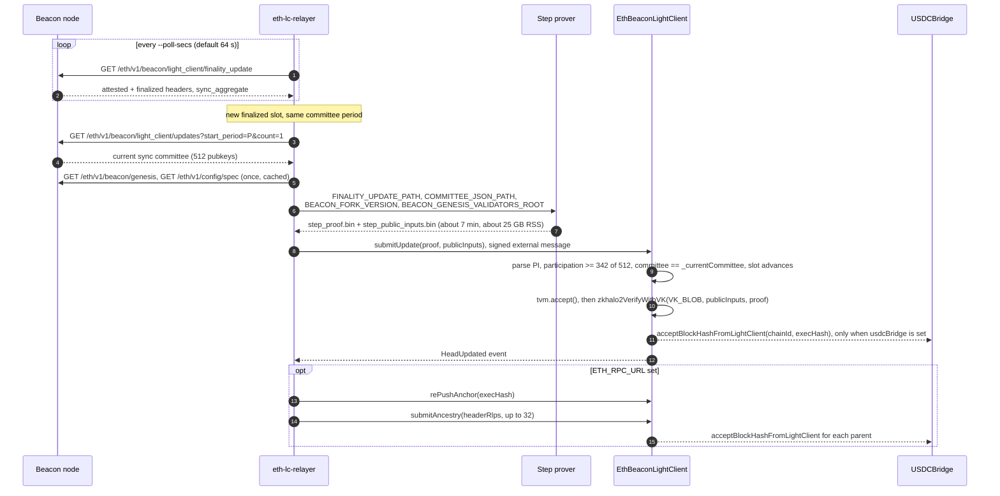
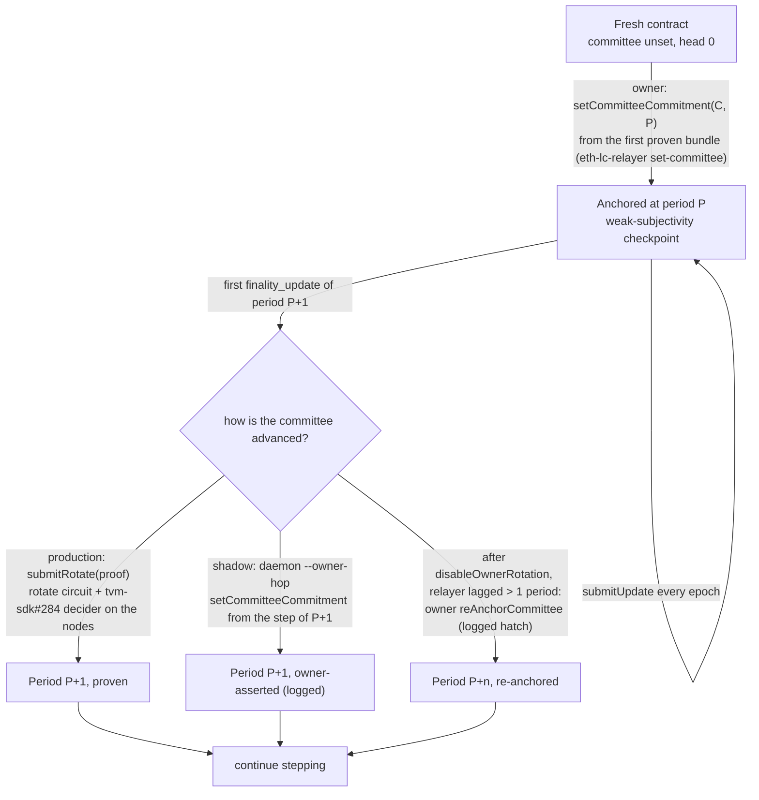
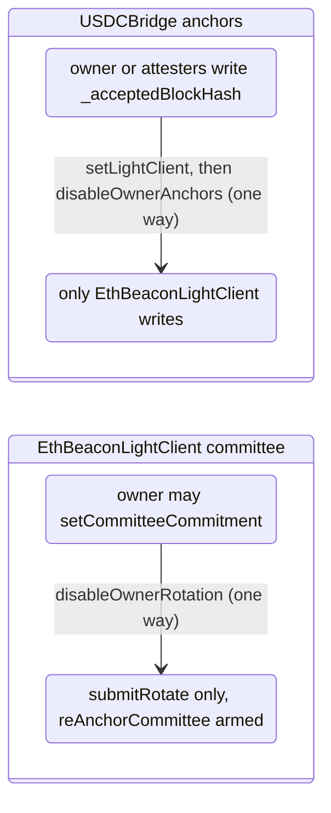
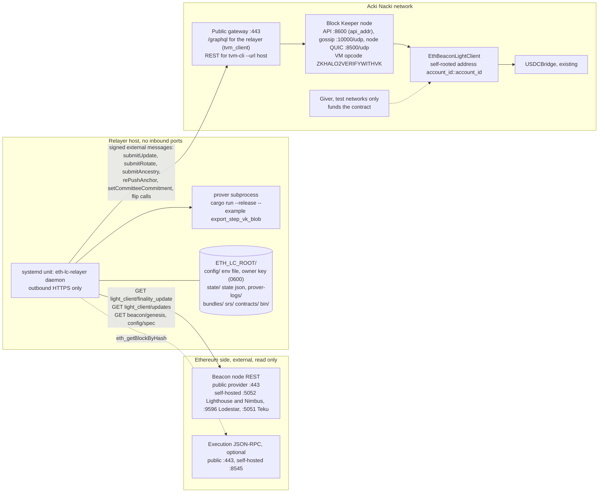

# Ethereum beacon light client on Acki Nacki

**Genre:** design and deployment reference (how it works, what runs where, how the pieces
talk). Operations are in the runbooks linked below; proof-system internals are in
`eth-light-client-prover/docs/`.

**Checked against:** branch `github/eth-light-client-prover-m6` at `675cbd5` (bridge PR #36) with
PR #42 (`feature/node-3917-sepolia-lite-client-shadow`) on top. `file:line` citations refer to
that tree. When code and this text disagree, the code wins.

**Related:** [`eth_light_client_trustless_deposit_plan.md`](eth_light_client_trustless_deposit_plan.md)
(why: the trust model this replaces),
[`crates/eth-light-client-relayer/deploy/shellnet-shadow/README.md`](../crates/eth-light-client-relayer/deploy/shellnet-shadow/README.md)
(shadow deployment kit), [`scripts/ursus/eth_lc_shellnet_e2e.md`](../scripts/ursus/eth_lc_shellnet_e2e.md)
(production E2E), [`scripts/ursus/flip_deposit_to_light_client.md`](../scripts/ursus/flip_deposit_to_light_client.md)
(the one-way flip), `eth-light-client-prover/docs/m5_eth_beacon_light_client.md` (circuits).

## 1. What it is

The ETH → AN deposit path proves that a `Deposit` receipt sits in an Ethereum block with a given
hash, but a proof cannot say whether that block is on Ethereum's canonical, finalized chain.
`USDCBridge.finalizeDeposit` therefore only accepts deposits whose block hash is already in its
`_acceptedBlockHash` map. Today that map is written by a trusted key (the owner) or an attester
quorum. The light client replaces that writer with a proof of Ethereum finality.

"Light client" is three things, and none of them lives on Ethereum:

| Piece | Where it runs | What it is |
|---|---|---|
| **`EthBeaconLightClient`** | Acki Nacki, one contract per deployment | TVM Solidity contract. Holds the latest finalized Ethereum header (slot, beacon root, execution block hash) and the commitment of the current sync committee. Accepts a ZK proof that a newer finalized header was signed by that committee, then pushes the finalized execution block hash into `USDCBridge`. This is the source of truth. |
| **`eth-lc-relayer`** | a relayer host we run | Rust daemon. Polls a beacon node, runs the prover, sends the proof to the contract. It has no authority: a wrong proof is rejected by the contract, and anyone with a beacon node and enough RAM could run a second one. |
| **`eth-light-client-prover`** | spawned by the daemon on the same host | Halo2/BN254 circuits. The step circuit checks the Altair sync-committee BLS signature and the merkle branches from the signed header down to the execution block hash. Proofs verify on Acki Nacki through the node opcode `ZKHALO2VERIFYWITHVK` against the verification key embedded in the contract (`VK_BLOB`). |

The Ethereum side is read only: a beacon node REST API and, optionally, an execution JSON-RPC.
There is no Ethereum contract, no Ethereum key and nothing to deploy there.

The contract is written in TVM Solidity (`sold` compiler, `TvmCell`, `tvm.accept()`, the `gosh`
builtins), not EVM Solidity. The EVM contracts of the bridge under `contracts/ethereum/` are a
different language dialect and a different chain.

## 2. Components

| Component | Source | Runs on | Notes |
|---|---|---|---|
| `EthBeaconLightClient` | `contracts/an/EthBeaconLightClient.sol`, `contracts/an/EthKeccak.sol` | Acki Nacki | Compiled with `sold` (Linux release `gosh_0.81.0` or newer, `--tvm-version gosh`). `EthBeaconLightClient_rotate_decider.patch` is the same source as a patch for the `acki-nacki` tree; `scripts/check_eth_beacon_lc_sources.sh` keeps them identical. |
| `ZKHALO2VERIFYWITHVK` | tvm-sdk (node VM) | every Acki Nacki node | Verifies a SHPLONK proof against a caller-supplied VkBlob (dispatch `0xC7 0x4A`, see `AGENTS.md`). The rotate proof additionally needs the decider of tvm-sdk PR #284, which is not on every network yet. |
| `USDCBridge` | `acki-nacki` repo, patches `USDCBridge_12pi_chainid_allowlist.patch`, `USDCBridge_disable_owner_allows_light_client.patch`, `USDCBridge_forget_block_hash_from_light_client.patch` | Acki Nacki | Consumer. Gains `setLightClient`, `acceptBlockHashFromLightClient`, `forgetBlockHashFromLightClient` (one-year window; same sender gate, idempotent `delete`), and `disableOwnerAnchors` that accepts a configured light client. |
| `eth-lc-relayer` | `crates/eth-light-client-relayer/` | relayer host | `cargo build --release --features live-submit` for a binary that talks to Acki Nacki; without the feature it can only `--dry-run`. |
| Step prover | `eth-light-client-prover/examples/export_step_vk_blob.rs` | relayer host, child process of the daemon | Invoked as `cargo run --release --example export_step_vk_blob` with the witness passed through environment variables (`crates/eth-light-client-relayer/src/prover.rs:100`). |
| Rotate prover | `eth-light-client-prover/examples/rotate_tree_n8.rs` | relayer host | `EMIT_VKBLOB=1`, recursive aggregation over 8 shards (`src/prover.rs:202`). |
| Hermez KZG SRS, k=19 | file `kzg_bn254_19.srs` | relayer host | Same ceremony the opcode is keyed to. Public mirrors have been unreliable; copy from an existing relayer host (`deploy/shellnet-shadow/install-srs.sh` pins the sha256). |
| Beacon node | external | Ethereum | Must serve the light-client REST endpoints (`finality_update`, `updates`). Public ChainSafe Lodestar and Nimbus endpoints do; publicnode does not serve `updates`. |
| Execution node | external, optional | Ethereum | Only for epoch ancestry (`submitAncestry`), see §3.4. |
| Giver | shellnet zerostate giver | Acki Nacki shellnet | Funds the contract on test networks (`deploy/shellnet-shadow/fund-account.sh`). |

## 3. How it works

### 3.1 Overview

Data moves left to right. Ethereum is never written to. Acki Nacki is written to only through
signed external messages from the relayer, and the contract itself decides what to accept.

### 3.2 One step update

Every Ethereum epoch (32 slots, 6.4 minutes) the beacon chain finalizes a new checkpoint. The
daemon turns each one into a `submitUpdate`.

What the contract checks, in order (`contracts/an/EthBeaconLightClient.sol:248`): the public
inputs parse; at least 342 of 512 committee members signed (also enforced in-circuit); the
proof's committee commitment equals the anchored one; the finalized slot moves the head forward
(or back-fills a skipped checkpoint of the current committee); then `tvm.accept()` and the opcode.
The contract pays for the verification itself, which is why it holds a balance and why a bad
proof only wastes the contract's gas. `submitUpdate` is permissionless: the proof is the
authorization.

The 10 public inputs (`eth-light-client-prover/src/step.rs:104`), each a 32-byte little-endian
field element:

| # | Word | Meaning |
|---|---|---|
| 0 | `attested_slot` | slot of the header the committee signed |
| 1 | `finalized_slot` | slot of the finalized checkpoint the header points to |
| 2, 3 | `finalized_beacon_root` hi, lo | beacon block root of the checkpoint, two 16-byte halves |
| 4 | `participation` | number of committee bits set |
| 5 | `committee_commitment` | Poseidon commitment to the 512 signer keys (what `setCommitteeCommitment` and `submitRotate` anchor) |
| 6, 7 | `execution_block_hash` hi, lo | the finalized execution (EL) block hash, the value the deposit path consumes |
| 8, 9 | `attested_state_root` hi, lo | signed state root, used by the rotate join |

The signing domain (`fork_version`, `genesis_validators_root`) is a circuit witness, not a public
input, so one verification key serves mainnet and Sepolia. The relayer resolves both from the
beacon node (`crates/eth-light-client-relayer/src/source.rs:218`) and passes them to the prover.

### 3.3 Sync-committee periods, bootstrap and rotation

The 512-member sync committee changes every 256 epochs (8192 slots, about 27.3 hours). The
contract only accepts proofs signed by the committee whose commitment it holds, so somebody has
to move that commitment forward once per period.

- **Bootstrap** is the one trusted step of the whole design (weak subjectivity, as in every
  beacon light client): the owner writes the commitment of a committee it believes is honest,
  `setCommitteeCommitment` (`EthBeaconLightClient.sol:458`). The relayer takes it from public
  input word 5 of a freshly proven bundle (`eth-lc-relayer set-committee`).
- **Rotate** (`submitRotate`, `EthBeaconLightClient.sol:335`) proves that the next committee
  is the one the current committee signed for, so the chain of committees becomes trustless. The
  daemon does this by default on a period jump (`src/relayer.rs:152`). It needs the rotate
  decider from tvm-sdk PR #284 in the node VM; on a network without it `submitRotate` is
  unsound and must stay off (`--no-rotate`).
- **Owner hop** (`--owner-hop`, `src/relayer.rs:215`) is the shadow substitute: prove a step of
  the new period, write its commitment with the owner key, submit the same bundle. It is refused
  once `disableOwnerRotation` has been called.
- **Re-anchor** (`reAnchorCommittee`, `EthBeaconLightClient.sol:496`) is the emergency hatch
  after the flip: armed only when owner rotation is disabled, period cannot go backwards, never
  writes execution hashes, counted in `getCommitteeState().reAnchorsApplied`.

### 3.4 From a checkpoint to a deposit

A step proves one execution block per epoch, the checkpoint. The contract records it in its own
`_provenEthSlot` map (hash → Ethereum slot) and pushes it into `USDCBridge` through an internal message
(`_pushExecHash`, `_notifySink`). A hash older than one year behind head is not live. Deposits in the other 31
blocks of the epoch are covered by **ancestry**: the daemon fetches the epoch's execution
headers over JSON-RPC, and `submitAncestry(headerRlps)` (`EthBeaconLightClient.sol:369`)
keccak-hashes each RLP header in the VM and walks `parentHash` from the proven checkpoint
backwards, pushing every hash on the way. With `ETH_RPC_URL` set the daemon does this after
every accepted update (`src/relayer.rs:364`); without it only checkpoint blocks are usable for
deposits.

`rePushAnchor` (`EthBeaconLightClient.sol:404`) re-sends an already proven hash to the bridge.
The push is `bounce: true`; a bounce (bridge not yet configured, wrong address) emits
`AnchorPushBounced` and the daemon retries with `rePushAnchor` on the next accepted update.

**Anchor keys are not Ethereum byte order.** The step circuit splits a 32-byte hash with
`node_hi_lo`, which reads each 16-byte half little-endian, so the contract keys everything by
`(LE(h[0..16]) << 128) | LE(h[16..32])` — the same word the bridge holds and the deposit public
inputs carry. A block explorer's `0xaf0919eb…` is stored as `0xa3e073c2…`. Keccak inside the VM
returns Ethereum order, so `submitAncestry` re-packs through `_anchorKey` before touching
`_provenEthSlot`, and the daemon re-packs through `anchor_key_hex` before calling `rePushAnchor`.
Calling either with the explorer's order silently misses the map: `ERR_UNKNOWN_CHECKPOINT` /
`ERR_NOT_PROVEN` (compute phase, exit 252).

`finalizeDeposit` on `USDCBridge` is unchanged: it still reads `_acceptedBlockHash`. Only the
writer of that map changes.

### 3.5 The trust switches

Two one-way switches move the deployment from key-trusted to proof-trusted. The daemon issues
them after its first accepted `submitUpdate` unless started with `--no-flip-owner`
(`src/relayer.rs:326`); `eth-lc-relayer flip-owner` does the same in one shot. The relayer key
must be the owner key of both contracts.

Before the flip the light client is advisory: it pushes hashes, but the owner key can still push
anything. After the flip nothing but a valid proof adds a block hash. There is no way back; the
only recovery from a stalled relayer is `reAnchorCommittee`, which is logged on chain.

## 4. Deployment

### 4.1 Topology

Labels are roles, not machines. Ports are the software defaults; public providers sit behind
HTTPS on 443.

### 4.2 Ports and endpoints

| Hop | Protocol / port | Endpoint | Used by | Source |
|---|---|---|---|---|
| relayer → beacon node | HTTPS 443 (public), HTTP on the client's REST port when self-hosted | `GET /eth/v1/beacon/light_client/finality_update` | every poll | `src/source.rs:1` |
| | | `GET /eth/v1/beacon/light_client/updates?start_period=&count=1` | once per period, before a prove | `src/source.rs:248` |
| | | `GET /eth/v1/beacon/genesis`, `GET /eth/v1/config/spec` | once, cached | `src/source.rs:218` |
| relayer → execution node | HTTPS 443 (public), 8545 self-hosted default | JSON-RPC `eth_getBlockByHash` | ancestry, 32 calls per checkpoint | `src/source.rs:340` |
| relayer → Acki Nacki | HTTPS 443 | `/graphql` on the network gateway (`AN_GRAPHQL_URL`); tvm_client sends signed external messages and reads accounts | every submit | `src/an_config.rs:15` |
| operator → Acki Nacki | HTTPS 443 | `tvm-cli --url <gateway host>` (REST) for deploy, funding, getters | deploy kit | `deploy/shellnet-shadow/lib.sh` |
| self-hosted Acki Nacki node | TCP 8600 Block Keeper API (`api_addr`), UDP 10000 gossip, UDP 8500 node QUIC, gql-server TCP 3000 (`--listen`) | | | `acki-nacki` repo: `node/src/config/network_config.rs`, `gql-server/src/defaults.rs:4` |
| relayer host inbound | none | | | the daemon exposes no port; metrics are counters in the log |

Beacon client REST defaults are the clients' documented defaults (Lighthouse and Nimbus 5052,
Lodestar 9596, Teku 5051, Prysm gateway 3500). Light-client data serving must be enabled on a
self-hosted node; the flag name differs per client.

### 4.3 Files on the relayer host

Layout of `ETH_LC_ROOT` as the shadow kit creates it (`deploy/shellnet-shadow/lib.sh`); the
production unit in `scripts/ursus/` uses the same pieces under a different prefix.

| Path | Content | Sensitivity |
|---|---|---|
| `bin/` | `eth-lc-relayer` (built with `live-submit`), `tvm-cli` 3.0.6, `sold` | public |
| `src/bridge/` | this repository; the daemon runs the prover with `cargo run` inside `eth-light-client-prover/` | public |
| `srs/kzg_bn254_19.srs` | Hermez SRS, mode 0444 | public, integrity matters (sha256 pinned in `install-srs.sh`) |
| `contracts/` | compiled `EthBeaconLightClient.tvc`, `.abi.json` | public |
| `config/eth-lc-relayer.env` | endpoints, addresses, paths (see §4.4) | 0600, no secrets besides paths |
| `config/*.keys.json` | owner key of the light client (and, in production, of `USDCBridge`); giver key on test networks | 0600, never committed, never pasted anywhere |
| `state/eth-lc-relayer-state.json` | last finalized slot, committee period, `owner_flip_done`, `genesis_validators_root` pin (`src/state.rs:16`) | operational; losing it is safe (the contract is the truth, the file is re-derived) |
| `state/prover-logs/`, `bundles/` | prover transcripts and proof bundles per slot | operational |

### 4.4 Configuration

All settings are environment variables read by the `daemon` subcommand (each has a matching
`--flag`; `eth-lc-relayer daemon --help`).

| Variable | Meaning | Production | Shadow |
|---|---|---|---|
| `BEACON_URL` | beacon REST base URL | mainnet node with light-client endpoints | Sepolia public Lodestar |
| `LIGHT_CLIENT_PROVER_DIR` | checkout of `eth-light-client-prover/` | required | required |
| `STEP_SRS_PATH` | `kzg_bn254_19.srs` | required | required |
| `AN_GRAPHQL_URL` | Acki Nacki GraphQL endpoint (HTTPS unless `--allow-insecure-graphql`) | network gateway | shellnet gateway |
| `AN_KEYS_PATH` | key file; must be the owner key of the light client (and of `USDCBridge` for the flip) | owner key | owner key |
| `AN_LC_ABI_PATH` | slim ABI `crates/eth-light-client-relayer/abi/EthBeaconLightClient.abi.json` | | |
| `AN_LIGHT_CLIENT`, `AN_SENDER` | light client address as `dapp_id::account_id` (self-rooted deploy: both halves equal) | | |
| `AN_USDC_BRIDGE`, `AN_USDC_ABI_PATH` | `USDCBridge` address and slim ABI | set | empty |
| `ETH_RPC_URL` | execution JSON-RPC for ancestry and `rePushAnchor` | set | optional |
| daemon flags | | none (rotate on, flip on) | `--no-rotate --no-flip-owner --owner-hop` |

### 4.5 Procedure

Production (`scripts/ursus/eth_lc_shellnet_e2e.md`, `scripts/ursus/flip_deposit_to_light_client.md`):

1. Nodes run a tvm-sdk with the rotate decider (PR #284).
2. `USDCBridge` carries the two patches; note its owner key.
3. Compile and deploy `EthBeaconLightClient(pubkey, l1ChainId, 0, 0)` with `sold`; fund it.
4. Build the relayer with `--features live-submit`; install the SRS; fill the env file.
5. `prove-one` → `set-committee` (bootstrap) → `submit-one`; check `getHead`.
6. Start the systemd unit. After the first accepted update the daemon calls `setLightClient`,
   `disableOwnerAnchors`, `disableOwnerRotation`. From here on the owner key cannot add hashes.

Shadow (`crates/eth-light-client-relayer/deploy/shellnet-shadow/README.md`): same steps 3 to 5
with the kit scripts (`build.sh`, `install-srs.sh`, `compile-contract.sh`, `deploy-contract.sh`,
`status.sh`), no `USDCBridge`, unit started with `--no-rotate --no-flip-owner --owner-hop`.
Nothing it does reaches the bridge.

### 4.6 Modes

| | Production | Shadow |
|---|---|---|
| Contract | the one `USDCBridge` points at | a private one, `usdcBridge` unset |
| Period change | `submitRotate` (proof) | owner hop (key, logged) |
| Owner flip | issued by the daemon | never |
| Reaches `finalizeDeposit` | yes | no |
| Needs tvm-sdk #284 on nodes | yes | no |
| Purpose | trustless canonicality for deposits | prove the pipeline beacon → proof → opcode → head on a live network |

## 5. Operating numbers

Measured on a 48-thread host with the shadow deployment against Sepolia (September 2026):

| Quantity | Value |
|---|---|
| Step proof, k=19 | about 7 min wall (keygen 4.5, prove 3; the proving key is not cached yet), about 25 GB RSS |
| Rotate proof | about 30 min, about 40 GB |
| Submit cadence | one `submitUpdate` per Ethereum epoch (6.4 min); head lags Ethereum finality by about one epoch |
| Period hop | every 8192 slots, about 27.3 h |
| Contract gas | about 0.57 shell per accepted update on shellnet; fund ahead of that burn |
| Proven-hash window | one year of Ethereum slots (`SLOTS_PER_YEAR = 2_628_000`). Hashes older than `head - 1y` are not `isProven`, are deleted from the FIFO (128/tx), and the sink is told `forgetBlockHashFromLightClient` (`USDCBridge_forget_block_hash_from_light_client.patch`). |
| Daemon memory at rest | about 14 GB of page cache, the proof is the peak |

## 6. Verifying a deployment

- `getHead()` (`EthBeaconLightClient.sol:583`) returns `finalizedSlot`, `finalizedBeaconRoot`,
  `executionBlockHash`, `committeeCommitment`, `updatesApplied`; `getCommitteeState()`
  (`:619`) returns the committee, period, `ownerRotationEnabled`, `reAnchorsApplied`.
- Roots come back in the contract's encoding: `(hi << 128) | lo` over little-endian 16-byte
  halves, the same convention `USDCBridge._parseBlockHash` uses. Byte-reverse each half to get
  the Ethereum hex; `deploy/shellnet-shadow/status.sh` prints both.
- Check any recorded execution hash against an independent Ethereum node:
  `eth_getBlockByHash` must return a block, and `eth_getBlockByNumber` for that height must
  return the same hash.
- Journal lines to expect: `submitUpdate accepted slot=…` every 7 to 13 minutes;
  `owner hop: setCommitteeCommitment accepted` (shadow) or `submitRotate accepted`
  (production) once per period; `rePushAnchor accepted`, `submitAncestry accepted` when
  `ETH_RPC_URL` is set.
- The state file is pinned to the first `genesis_validators_root` it sees
  (`src/relayer.rs:414`); pointing a daemon at another network fails instead of mixing heads.

## 7. Known limits

- `submitRotate` needs the tvm-sdk #284 decider in the node VM; networks without it run
  step-only with owner hops.
- The proving key is rebuilt for every proof (about 4.5 of the 7 minutes).
- Any change to the step circuit changes `VK_BLOB`; the contract is upgraded in place with
  `updateCode` (`EthBeaconLightClient.sol`), which carries head, committee and the one-year
  proven FIFO across the upgrade (this encoding is not compatible with the old
  `mapping(uint256 => bool)`). The tvm-sdk opcode fixtures and the acki-nacki patch must be re-emitted
  with the same blob (`scripts/check_rotate_vkblob_accumulator.sh`,
  `scripts/check_eth_beacon_lc_sources.sh`).
- Public beacon providers differ in what they serve; a production deployment wants its own
  beacon node with light-client data enabled.
